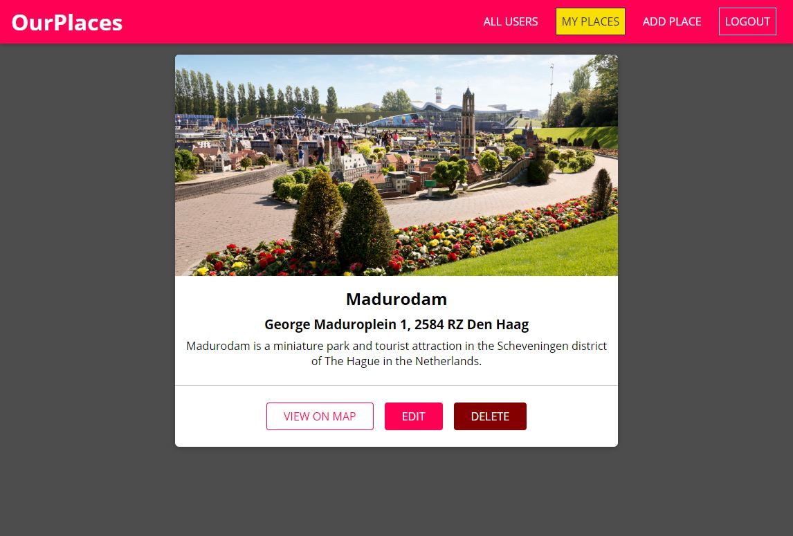

# OurPlaces Application

Share the places that you like or you've visited, to make a collection of our nice places.

It's a `MERN` application built using: `React` a framework to build component-based web applications with `Hooks` to manage rendering the components and the state within and between them. In addition to `Node.js` and `Express` as a backend `server` to manage the connections between the database `MongoDB` (noSQL database) and the client `React`. `Authentication` that uses `Json Web Token`. Also you can `upload photos` with the help of `multer`.

`TypeScript` is mostly used here along with `React`.

Splitting the code is a very useful lesson of making this app.

the application is deployed on more servers that offer free services to host `SPA`'s and backend servers.



## Backend link to `Heroku`:

https://our-places-app.herokuapp.com/api/users

## Frontend link to `Firebase`:

https://ourplacesapp.web.app/

## Combined deployment of both frontend and backend on one server of `Heroku`:

https://our-places-app.herokuapp.com/

# To Start:

## Install the required packages by the following command:

```
npm run dependencies
```

## Sign in with a google account, then create a project at the following link to get a `key`:

```
https://console.cloud.google.com/google/maps-apis
```

## In the `backend` folder, create `nodemon.json` file to store the `environment variables` of the backend that contains the following syntax:

```
{
  "env": {
    "GOOGLE_API_KEY": "<Your google maps api key>",
    "DB_USER": "<mongodb database username>",
    "DB_PASSWORD": "<mongodb database password>",
    "DB_NAME": "<mongodb database name>",
    "JWT_SECRET": "<Your secret to use with json web token>"
  }
}
```

## In the `frontend` folder, create `.env` file to store the `environment variables` of the frontend that contains the following syntax:

```
REACT_APP_GOOGLE_API_KEY=<Your google maps api key>
REACT_APP_BACKEND_URL=<your backend server url>/api
REACT_APP_ASSET_URL=<your backend server url>
```

## Run the following command to start the app in the development mode:

```
npm run dev
```

## Run the following command in the root folder or in the `frontend` one to make a production build for the frontend of the application:

```
npm run build
```
